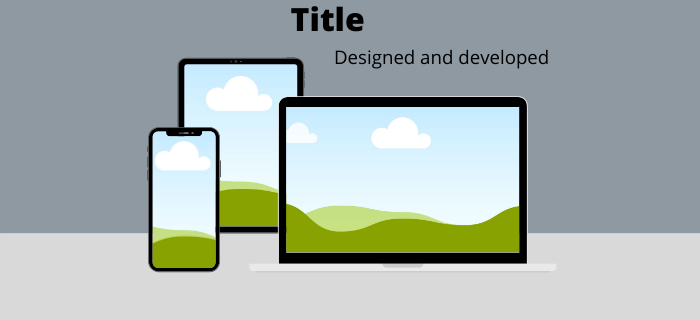

<h1 align="center">Resolve Games</h1>

<h2 align="center">  </h2>

Resolve games is a website inspired by retro board games with the vision of bringing those much loved classics back up to date and onto your device. Not only will visitors be able to play these games, but also leave suggestions for more games they would like to see added.

The website has 3 main pages, 'Home'(the landing page), 'Simon Game' and 'Pairs Game', each of which contain a feedback section where visitors can leave there suggestions. Also, features and games are fully responsive meaning everything will still work on mobile devices.  

<h2 align="center"></h2>

## User Experience (UX)

- ### User stories
    - #### First Time Visitor Goals
        1. As a First Time Visitor, I want to easily understand the main purpose of the site.
        2. Also, I want striking imagery to help visually represent each section.
        3. Also, I want to be able to easily navigate throughout the site on any device to find content.

    - #### Returning Visitor Goals
        1. As a Returning Visitor, I want to play the games again and attempt to beat my previous scores.
        2. Also, I want to easily send suggestions for new games and/or updates that can be added.

    - #### Frequent User Goals
        1. As a Frequent User, I want to check to see if there are any newly added features and games.

- ### Design
    - #### Colour Scheme
        - The 2 primary colors I chose for my project was an off white (hex color #f7f7f7) and a strong blue (hex color #1c75bc). 
        From the beginning of the design process, my goal was to design a very clean, simplistic yet effective website with multiple
        interactive features that make for great user experience. ****//For example the navigation bar which collapses into a 'hamburger' menu
        on mobile and tablets for easier navigation through the site.///*** I picked these two colors as they really compliment each other and in 
        my opinion radiate cleanliness and simplicity. The psychological affects that the color scheme has on the user is instant and can literally
        dictate whether the user will continue to browse the site or leave.
            - [#f7f7f7](https://www.colorhexa.com/f7f7f7) (off-White): The off-white was used for the background color of the website. This is because,
            as opose to black, white is a reflective color which creates almost an invisible barrier to the user where they would sub-constiously beable
            to interact with the pages better as we are less likely to click on white compared to a more contrasting color. 
            - [#1c75bc](https://www.colorhexa.com/1c75bc) (Strong Blue): The strong blue color was used for all the titles/sub-titles, buttons and shadows.
            These contrasts realy well against off-white background and are eye-catching and 'stand-offish'. Strong blues stimulate clear thoughts and allow 
            for better reading.
        To conclude, the color scheme is implemented to create a clean, slick, professional look which allows for better user experience and increasing possibilities
        of that particular visitor to return again.
    - #### Typography
        - The Oswald font is the only externally imported font that was used throughout the entire website with Sans Serif as the fallback font in case, for any 
        reason, the font isnt being imported to the site correctly. Oswald was used for all the headers, sub-headers and areas of key importance in order to
        maintain a professional look throughout and create clear distinction from the content text. This font was imported to the 'styles.css' from Google Fonts,
        where it is very easy to import from and are also a extremely reliable external source. The font is available in 6 different weights from 'Extra-light' (200 weight) 
        to 'Bold' (700 wight). Not only that, but they also provide a 'Variable weight axis' where you can set a custom font weight to import so you're not limited
        in any way. However, for this particular project, I kept to the base font weight as i thought that was the best match in this instance.
    - #### Imagery
        - Imagery was a big factor considered throughout the entirety of the development as it has such a powerful impact on users, which can be seen on instant
        execution of the landing page. I took extra measures when searching for images so they would maintain the correct aspect ration without having to alter
        them too drastically with hard code which can sometimes ruin the quality of an image. I also focussed on obtaining images which would best suit there
        place on the website and work well with the color scheme.

## Features

**Note:** All Features Information can be located in seperate [FEATURES.MD File](..link..) due to length of content.

## Technologies Used

- ### Languages Used
    - [HTML5](https://en.wikipedia.org/wiki/HTML5)
    - [CSS3](https://en.wikipedia.org/wiki/Cascading_Style_Sheets)
    - [JavaScript](https://en.wikipedia.org/wiki/JavaScript)

- ### Programs Used
1. [Google Fonts:](https://fonts.google.com/)
    - Google fonts were used to import the 'Oswald' font into the 'styles.css' file which is used on all pages throughout the project.
2. [Git](https://git-scm.com/)
    - Git was used for version control by utilizing the Gitpod terminal to commit to Git and Push to GitHub.
3. [Gitpod:](https://www.gitpod.io/)
    - Gitpod was the primary IDE used throughout the entirety of the project. 
4. [GitHub:](https://github.com/)
    - GitHub is used to store the projects code after being pushed from Git.
    - The website is also deployed using GitHub Pages.
5. [Photoshop:](https://www.adobe.com/ie/products/photoshop.html)
    - Photoshop was used for resizing images and editing photos to better suit the website. 
6. [Web Formatter](https://webformatter.com/)
    - Web Formatter was used on all HTML, CSS and JS to beautify code to keep it neat and easy to read. 
    This can also be done by utilising Beautify Cmd (Shift + Alt + F) in GitPod.

## Testing

The W3C Markup Validator and W3C CSS Validator Services were used to validate every page of the project to ensure there were no syntax errors in the project.
- [W3C Markup Validator](https://jigsaw.w3.org/css-validator/#validate_by_input) - [Results](...link...)
- [W3C CSS Validator](https://jigsaw.w3.org/css-validator/#validate_by_input) - [Results](...link...)

### Testing User Stories from User Experience (UX) Section

- #### First Time Visitor Goals
    As a First Time Visitor...
    1. I want to easily understand the main purpose of the site.
        1. Upon entering, you are greated with an informative hero image which described the goal of the site and a clear, easy to read navigation bar.
        2. As the hero image only takes up 50 percent of the viewport height the user will still be able to see the game selection area which would intise them to look at.
        3. The user can see exactly what the purpose of the site is without having to scroll down the page leaving them with the biggest question... "Which game should I play first".

    2. I want striking imagery to help visually represent each section.
        1. As stated before, the landing page hosts the main hero image which instantly informs the user what the site is for.
        2. Each game also has its own hero image which, on click, links the user from the landing page, to that particular game.
        3. All images are fully responsive and have been alterd to look good on any device size.

    3. I want to be able to easily navigate throughout the site on any device to find content.
        1. The site has been designed to never to entrap the user. The navigation bar moves freely as the user scrolls up and down the page and triggers a JavaScript effect which adds a background to the header to avoid being unable to read the links. 
        2. At the bottom of each page, there is a 'Back To Top' bottom to further ensure the user never gets trapped.
        3. On the Suggestions Form, after a form response is submitted, the 'Send' button changes to 'Sent' to verify to the user there message has been sent.

- #### Returning Visitor Goals
    As a Returning Visitor...
    1. I want to play the games again and attempt to beat my previous scores.
        1. The simon game will run an infinite amount of rounds untill the user clicks the wrong button. For each correct click, there is a turn counter in the center which will update and show how many correct buttons have been pressed in a row.
        2. For the pairs game, the user could time themselves and keep track of that to give themselves something to improve on.

    2. I want to easily send suggestions for new games and/or updates that can be added.
        1. The navigation bar clearly highlights the "Contact" section which will automatically scroll the user down to that section.
        2. Here they can fill out the form on any of the pages and you won't be transferred to somewhere else.
        3. A form section is on each page and for the games, the form can be found direcly below them so the user wont be led away. 

- #### Frequent User Goals
    As a Frequent User...
    1. I want to check to see if there are any newly added features and games.
        1. The landing page will always be the host for game selection. As new games and features are added they will be showcased there.

### Further Testing
- The Website was tested on Google Chrome, Internet Explorer, Microsoft Edge and Safari browsers. 
- The website was viewed on a variety of devices such as Desktop, Laptop, Samsung Galaxy S10, iPhone 6s & iPhoneX.
- A large amount of testing was done to ensure that everything rendered and linked correctly on all browsers and a wide variey of devices. 
- Friends and Family members were asked to review the site and report feeback on any bugs and/or user experience issues/negative experiences.

### Known Bugs
- NOT DOCUMENTED YET
